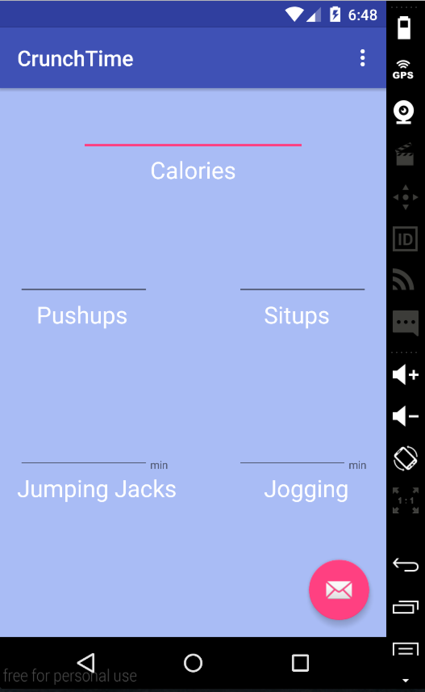

# PROG 01: Crunch Time

CrunchTime is a simple calorie converter app that allows users to see how many calories they have burned in their workout.

## Authors

Tait Gu ([taitgu@berkeley.edu](mailto:taitgu@berkeley.edu))

## Demo Video

See CrunchTime Tutorial (https://youtu.be/O6jAwzq_30w)

## Screenshots

## Acknowledgments

* Thank you kind users of StackOverflow

